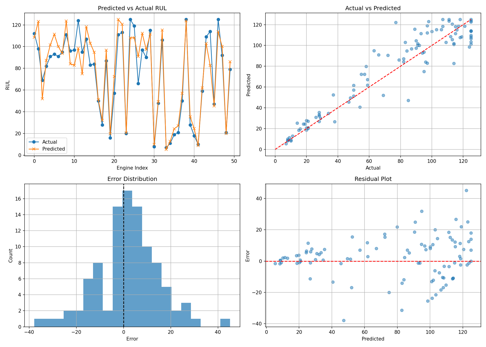

# Predictive Maintenance of Turbofan Engines using LSTM

## Overview

This project predicts the **Remaining Useful Life (RUL)** of aircraft turbofan engines using the NASA C-MAPSS FD001 dataset. A Long Short-Term Memory (LSTM) neural network was trained on multivariate time-series sensor data to learn engine degradation patterns and estimate the number of operational cycles remaining before engine failure.

---

## Problem Statement

Unexpected engine failures can lead to increased maintenance costs, operational downtime, and safety risks. Traditional maintenance strategies often rely on fixed schedules, which may result in either premature maintenance or delayed fault detection.

The objective of this project is to develop a predictive maintenance system capable of estimating the Remaining Useful Life (RUL) of turbofan engines using historical sensor measurements. Accurate RUL prediction enables condition-based maintenance and helps prevent unexpected failures.

---

## Dataset

**Dataset:** NASA C-MAPSS Turbofan Engine Degradation Simulation Dataset

**Source:** NASA Prognostics Center of Excellence

**Subset Used:** FD001

### Dataset Characteristics

* Train Trajectories: 100 Engines
* Test Trajectories: 100 Engines
* Operating Conditions: Single (Sea Level)
* Fault Mode: High Pressure Compressor (HPC) Degradation

The dataset consists of multivariate time-series sensor measurements recorded throughout the operational life of multiple engines. Each engine begins with different initial wear conditions and gradually develops degradation until failure.

The training dataset contains complete run-to-failure trajectories, while the test dataset contains truncated trajectories along with true Remaining Useful Life (RUL) values.

---

## Experimental Scenario

Each engine operates normally at the beginning of its life cycle and gradually develops a fault. In the training set, degradation continues until engine failure. In the test set, engine trajectories are stopped before failure occurs.

The goal is to predict the number of cycles remaining before failure using sensor measurements collected during engine operation.

---

## Data Preprocessing

The following preprocessing steps were performed:

1. Data Loading and Exploration

2. Missing Value Check

3. Removal of Zero Variance Features

4. RUL Computation using:

   RUL = Maximum Cycle − Current Cycle

5. Feature Selection

6. Feature Normalization using StandardScaler

7. Sliding Window Sequence Generation

8. Sequence Padding for Short Test Sequences

---

## Sequence Generation

* Sequence Length: 30 Cycles
* Sliding Window Technique Used
* Approximately 17,000 overlapping training sequences generated

### Training Data

For each engine, overlapping sequences of 30 consecutive cycles were generated. The target label for each sequence was the RUL corresponding to the last cycle in the sequence.

### Test Data

For each engine, only the final 30 cycles were used for prediction. Engines with fewer than 30 cycles were padded with zeros.

---

## Model Architecture

The project uses a Long Short-Term Memory (LSTM) neural network implemented in PyTorch.

### Why LSTM?

LSTM networks are specifically designed for sequential and time-series data. They can capture long-term temporal dependencies and degradation trends present in engine sensor measurements.

### Components

* LSTM Layer
* Fully Connected Output Layer
* Mean Squared Error (MSE) Loss
* Adam Optimizer

---

## Technologies Used

* Python
* PyTorch
* NumPy
* Pandas
* Scikit-Learn
* Matplotlib
* Machine Learning
* Deep Learning
* LSTM Networks
* Time-Series Analysis

---

## Methodology

1. Data Loading
2. Data Cleaning
3. RUL Computation
4. Feature Selection
5. Data Normalization
6. Sequence Generation
7. LSTM Model Training
8. Performance Evaluation

---

## Results

| Metric   | Value  |
| -------- | ------ |
| RMSE     | 13.364 |
| MAE      | 9.882  |
| R² Score | 0.8898 |

The model successfully learned degradation patterns from sensor data and achieved strong predictive performance on unseen test engines.

---

## Prediction Results



---

## Requirements

- Python 3.9+
- NumPy
- Pandas
- Scikit-Learn
- PyTorch
- Matplotlib
- Jupyter Notebook
---
Install packages using
```
pip install -r requirements.txt
```
## Future Improvements

* Hyperparameter Optimization
* Multi-Fault Prediction using FD002, FD003 and FD004 datasets

---

## Author

Soham Kumar

B.Tech Computer Engineering
